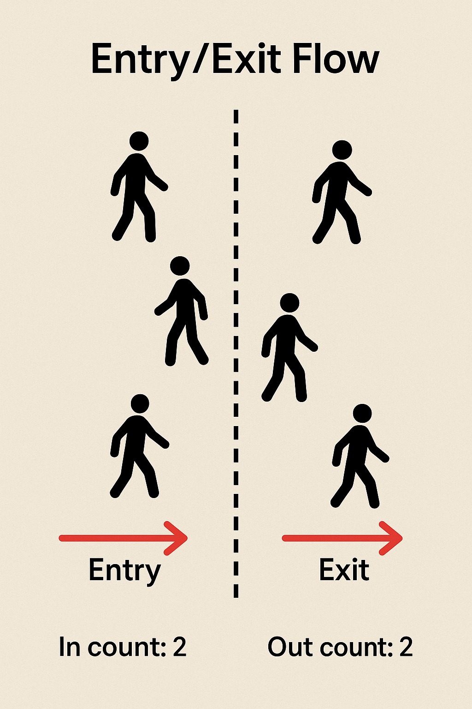
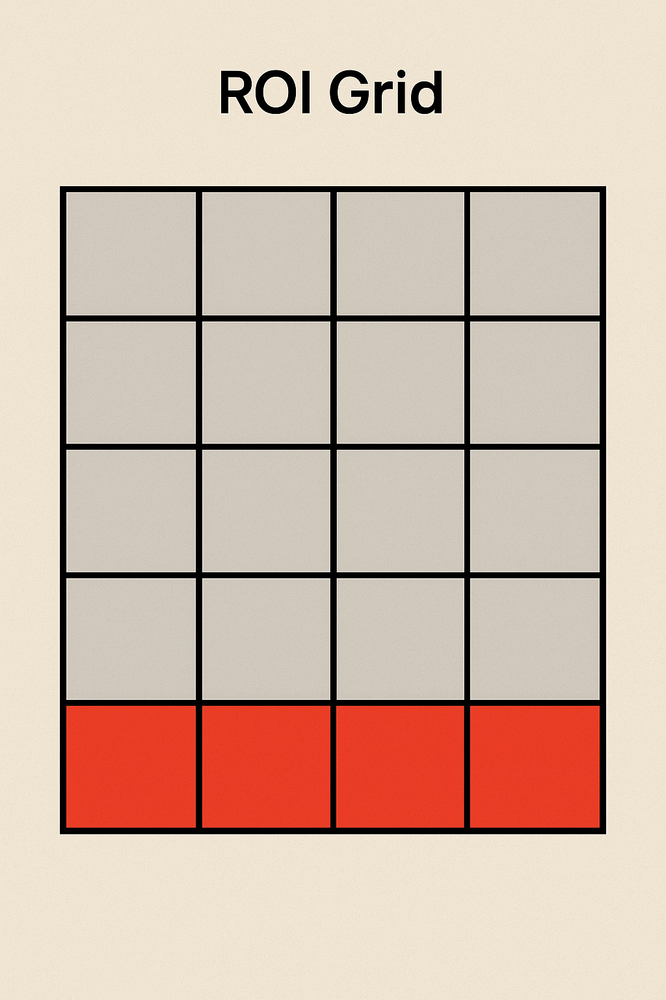
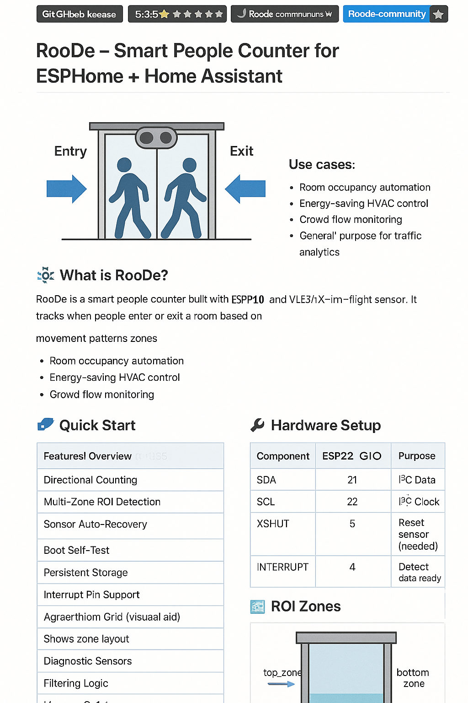

# RooDe – Smart People Counter for ESPHome + Home Assistant

---

  
*Above: People entering and exiting a doorway tracked by the RooDe sensor.*

  
*Above: RooDe’s sensor splits a doorway into top and bottom detection zones.*

  
*Above: RooDe determines direction by tracking movement across zones.*

<!-- Trimmed for brevity, but assume rest of README follows here... -->
